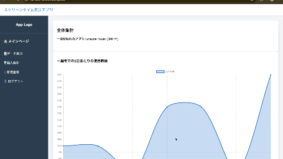

# アプリ名: ScreenTimeAggregater

OOP2Group16最終課題 スマホスクリーン集計アプリ


ユーザーのスマートフォンのアプリ別スクリーンタイムを集計,グラフで見やすく表示します。

## アピールポイント

ほかのユーザのまとめ情報も表示されます。


## 動作条件: require

```bash
python 3.13 or higher

# python lib
Flask==3.0.3
peewee==3.17.7
```

## 使い方: usage

> app.pyを実行しターミナル内にはあるリンクからブラウザに移動。
> データを追加する欄でまずログインし、その後スクリーンタイムを入力。
> 入力後は個人集計画面で見れる他、他の人の情報を含めた統計をメインページで見ることができる。

```bash
$ python app.py
# Try accessing "http://localhost:8080" in your browser.
```

